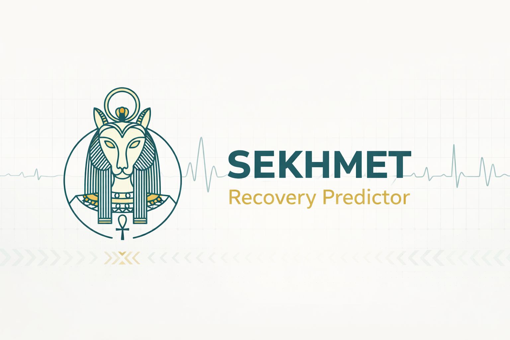

<p align="center">
  
</p>

# SEKHMET Recovery Predictor

> **FOR RESEARCH/OPERATIONAL PLANNING ONLY – NOT FOR CLINICAL DIAGNOSIS**
>
> This tool supports workforce capacity planning and operational decision-making.
> It is **not** a medical device and must **not** be used for individual clinical
> diagnosis, treatment decisions, or to determine fitness for duty.
> Clinical decisions require qualified healthcare professionals with access
> to full patient history.

**Predict recovery trajectories for injured personnel.**

Evidence-based recovery prediction tool with Cox proportional hazards modelling calibrated to peer-reviewed military and civilian literature.

<a href="https://pj-sekhmet-ckltbh5thn6walldqpr2pt.streamlit.app"></a>
<a href="https://codespaces.new/RossTylr/Pj-SEKHMET"></a>

---

## Live App

**[Open SEKHMET Recovery Predictor](https://pj-sekhmet-ckltbh5thn6walldqpr2pt.streamlit.app)** - No installation required!

---

## Features

### Three Prediction Models

| Model | Description | Use Case |
|-------|-------------|----------|
| **Cox PH (Evidence-based)** | Cox proportional hazards with Weibull baseline, calibrated to peer-reviewed sources | Clinical decision support, research |
| **Bayesian (Clinician-adjustable)** | Adjustable parameters for local calibration | Site-specific tuning |
| **XGBoost (ML/SHAP)** | Machine learning with SHAP explainability | Research, model comparison |

### Individual Prediction
- Input case details (injury type, body region, severity, risk factors)
- **Traffic light summary** (RTD likelihood at 3/6/12 months)
- Recovery timeline with **survival curves and 90% CI**
- Hazard ratio contributions
- **Model agreement comparison** (Cox vs XGBoost)
- **Comparator benchmark** (your case vs typical 30yo)

### Cohort Planning
- Forecast recovery timelines across a team
- Gantt-style availability planning
- Band distribution analysis

### References Tab
- **Full reference list** with DOI links
- **Parameter-to-source mapping** table
- **Evidence summary** statistics and charts
- **BibTeX and text export** for citation managers

---

## Quick Start

### Option 1: Use the Live App (Recommended)

Click the Streamlit badge above or visit [pj-sekhmet-ckltbh5thn6walldqpr2pt.streamlit.app](https://pj-sekhmet-ckltbh5thn6walldqpr2pt.streamlit.app)

### Option 2: Run in GitHub Codespaces

Click the Codespaces badge to open a fully-configured development environment. The Streamlit app will automatically launch on port 8501.

### Option 3: Run Locally

```bash
cd src/predictor
pip install -r ../../requirements.txt
streamlit run app.py
```

---

## Evidence Base

The Cox model is calibrated to clinical literature including:
- **9 peer-reviewed sources** from military and civilian populations
- **6 military-specific studies** (UK and US)
- **2,235 total sample size** across studies
- Documented risk factors with hazard ratios

### Key Sources

| Source | Year | Focus | Military |
|--------|------|-------|----------|
| Olivotto et al. | 2025 | MSKI prognostic factors | No |
| Marquina et al. | 2024 | ACL reconstruction meta-analysis | No |
| KCMHR Phase 4 | 2024 | UK military mental health | Yes |
| Anderson et al. | 2023 | Military academy epidemiology | Yes |
| Rhon et al. | 2022 | Spine rehabilitation | Yes |
| Antosh et al. | 2018 | ACL RTD in military | Yes |
| Wiggins et al. | 2016 | ACL reinjury rates | No |
| Hoge et al. | 2014 | Military PTSD | Yes |
| Shaw et al. | 2019 | Occupational LBP factors | No |

Full citations available in the **References tab** of the app.

---

## Risk Factors (Hazard Ratios)

| Factor | HR | Effect | Source |
|--------|-----|--------|--------|
| Age (per decade >25) | 1.15 | Delays recovery | Anderson 2023 |
| Prior same-region injury | 1.80 | Delays recovery | Wiggins 2016 |
| Smoking | 1.43 | Delays recovery | Anderson 2023 |
| BMI >= 30 | 1.20 | Delays recovery | Olivotto 2025 |
| OH Risk High | 1.30 | Delays recovery | Shaw 2019 |
| Supervised rehabilitation | 0.75 | Accelerates recovery | Olivotto 2025 |

---

## Injury Types (MSKI)

| Type | Median Recovery | Evidence Grade |
|------|-----------------|----------------|
| MSKI minor | 1-3 months | Moderate |
| MSKI moderate | 3-9 months | Moderate |
| MSKI major | 6-12 months | Moderate |
| MSKI severe | 12-24+ months | Low |

---

## Recovery Bands

| Band | Range | Workforce Planning |
|------|-------|-----|
| **Fast** | 0-3 months | Short-term cover |
| **Medium** | 3-6 months | Medium-term adjustment |
| **Slow** | 6-12 months | Long-term planning |
| **Complex** | 12+ months | Permanent replacement |

---

## Project Structure

```
Pj-SEKHMET/
├── src/
│   └── predictor/
│       ├── app.py              # Streamlit UI (4 tabs)
│       ├── config.py           # Enums, EvidenceBase loader
│       ├── cox_model.py        # Cox PH survival model
│       ├── bayesian_model.py   # Bayesian adjustable model
│       ├── xgb_model.py        # XGBoost with SHAP
│       └── evidence_base.yaml  # Clinical parameters
├── .devcontainer/              # GitHub Codespaces config
├── requirements.txt
└── README.md
```

---

## Development Status

**Current Phase**: Research & Demonstration

### Completed Features

| Version | Feature | Status |
|---------|---------|--------|
| V1 | Core Cox PH prediction model | Complete |
| V1 | Streamlit UI with configurable bands | Complete |
| V1 | Bayesian clinician-adjustable model | Complete |
| V2 | XGBoost model with SHAP explainability | Complete |
| V2 | Occupational Health risk factor | Complete |
| V3 | Traffic light RTD summary | Complete |
| V3 | Survival curve with 90% CI | Complete |
| V3 | Model agreement indicator | Complete |
| V3 | Comparator benchmark | Complete |
| V4 | References tab with full citations | Complete |
| V4 | BibTeX/text export | Complete |
| V5 | Regulatory disclaimers & governance | Complete |
| V5 | Riley framework compliance tracking | Complete |
| V5 | Calibration status & validation roadmap | Complete |
| - | GitHub Codespaces support | Complete |

### Planned Features

| Feature | Status |
|---------|--------|
| CSV cohort upload | Planned |
| PDF report export | Planned |
| Real data validation | Pending data access |

---

## Methodological Limitations

Following the [PROGRESS framework](https://prognosisresearch.com) for clinical
prediction model research (Riley et al., BMJ 2020):

| Criterion | Status | Notes |
|-----------|--------|-------|
| **External Validation** | Not done | No validation against real outcomes |
| **Calibration Assessment** | Pending | Requires outcome data |
| **Discrimination (C-statistic)** | Not calculated | Requires validation dataset |
| **Clinical Utility** | Not assessed | No decision curve analysis |
| **Sample Size** | Synthetic | XGBoost: n=5,000 simulated cases |
| **Model Stability** | Variable | Cox stable; XGBoost potentially unstable |

### Appropriate Use

| Use Case | Appropriate? |
|----------|--------------|
| Workforce capacity planning | Yes |
| Resource allocation scenarios | Yes |
| Research demonstrations | Yes |
| Individual clinical decisions | No |
| Fitness assessments | No |

### Path to Validation

1. Obtain de-identified outcome data
2. Perform calibration assessment (predicted vs observed)
3. Calculate discrimination metrics (C-statistic)
4. Conduct decision curve analysis for clinical utility
5. External validation in independent cohort
6. Clinical governance approval

### References

- Riley RD et al. (2020). "Minimum sample size for developing a multivariable
  prediction model". BMJ. [doi:10.1136/bmj.m441](https://doi.org/10.1136/bmj.m441)
- [prognosisresearch.com](https://prognosisresearch.com) - PROGRESS framework resources
- [`pmsampsize`](https://github.com/cran/pmsampsize) - Sample size calculation tool

---

## License

MIT

---

*SEKHMET: Egyptian goddess of healing and war*
